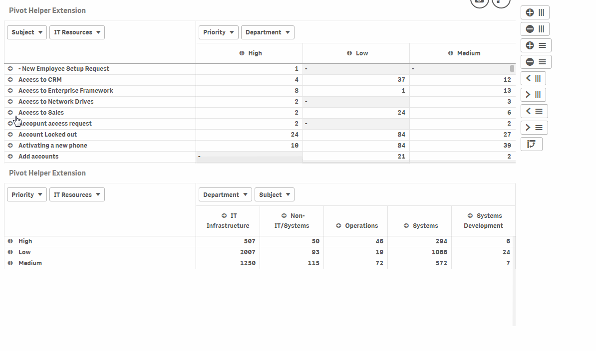

## Qlik Sense Extension Pivot Madness

An extension to mess around with Pivot Tables in Qlik Sense.

It provides all kinds of settings to switch things by button or to hide things by css (press F5 to reload sheet to make changes to appear).

### Parameters

#### Options

1. Patch all Pivots on Sheet: change options on all pivot tables (default), when set to 'off' the preceding pivot table object (placed on the sheet before this extension was added) is affected only

#### Top Dims

1. Hide (F5): hide dim buttons
1. Disable Interaction (F5): disable interactions on dim buttons
1. Disable Selection (F5): disable selection popup on dims
1. Show Expand Button: expand all
1. Expand All Levels: expand all levels, or first level only
1. Show Collapse Button: collapse all
1. Show Rotate to left Button: rotate dims to left
1. Show Rotate to right Button: rotate dims to right

#### Left Dims

Same options as for Top Dims (see above)

#### Full Expand

1. Show Full Expand 'on' Button: switch to full expand mode (collapse/expand button will not work anymore)
2. Show Full Expand 'off' Button: switch back to normal mode

#### Indent Mode

1. Show Indent Mode 'on' Button: switch to indent mode (like a hierarchy)
2. Show Indent Mode 'off' Button: switch back to normal mode (separated column per dim)

#### Transpose

1. Show Transpose Dims Button: switch Top Dims with Left Dims (or vice versa)

### Author

**Ralf Becher**

+ [irregular.bi](http://irregular.bi)
* [twitter/irregularbi](http://twitter.com/irregularbi)
* [github.com/ralfbecher](http://github.com/ralfbecher)

### License

Copyright © 2017 Ralf Becher

Released under the MIT license.

***